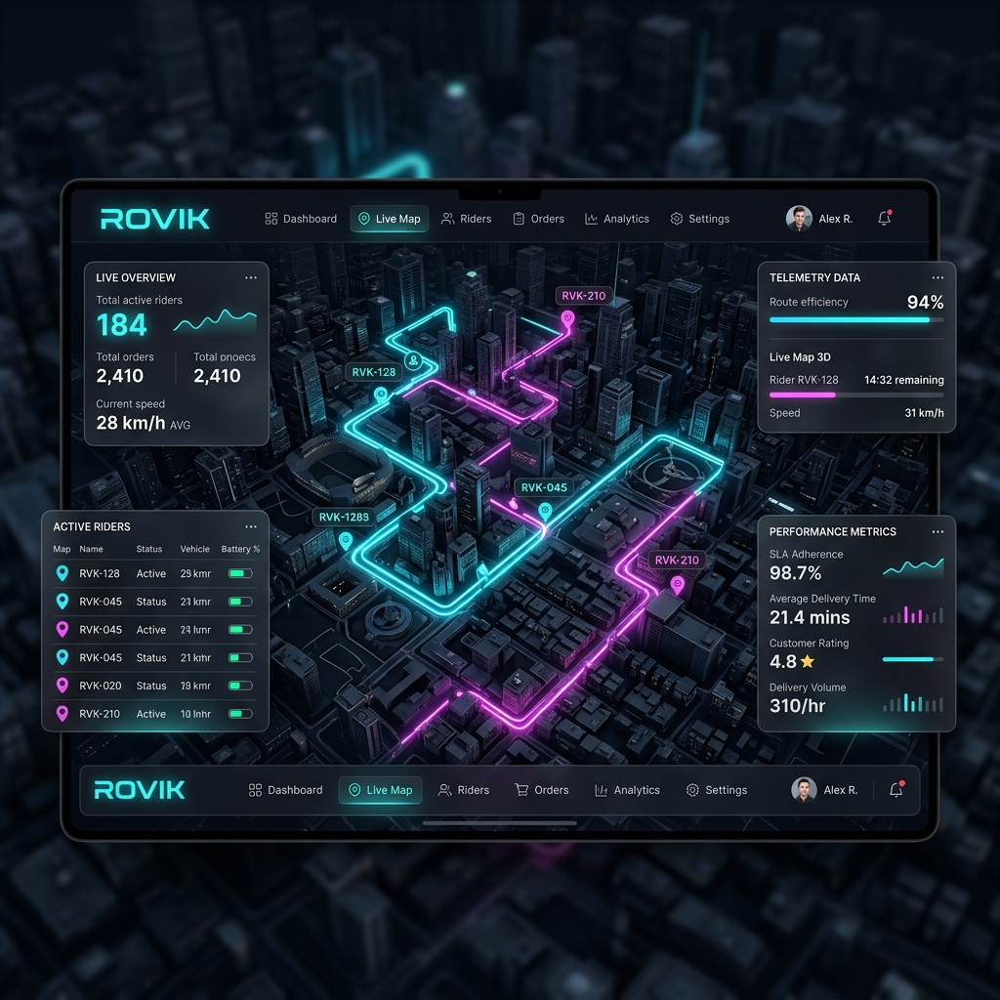
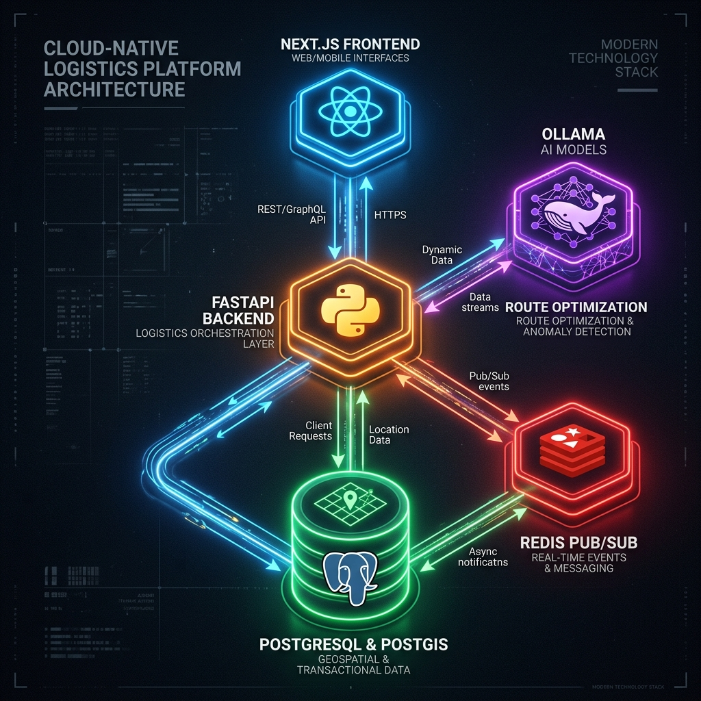
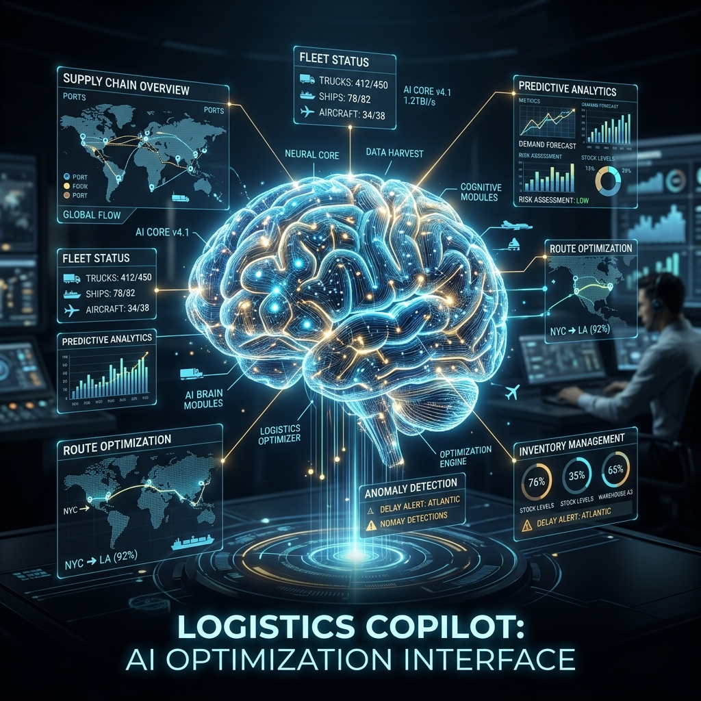

<div align="center">
  

  
  
  

  <h1>🚀 ROVIK Platform</h1>
  <h3>Combinatorial Optimization & Autonomous Logistics Orchestration</h3>
  
  <p>ROVIK is a textbook-example of modern Cloud-Native Event-Driven Architecture, combining Google OR-Tools for NP-Hard Vehicle Routing Problems (VRP) with Local LLMs for operational intelligence.</p>
</div>

---

## 1. Executive Summary

In traditional logistics, dispatch management breaks down under high velocity. As rider telemetry nodes increase, database locking and latency spikes cause map UI stuttering and incorrect ETA allocations. **ROVIK** solves this by decoupling the telemetry stream from the relational persistence layer, utilizing a **Redis Pub/Sub** mesh for live operations, and leveraging **Google OR-Tools** alongside predictive **XGBoost ETA models** for optimal fleet routing.

---

## 2. Platform Architecture

<div align="center">
  
  <p><em>Figure 1: Cloud-Native Logistics Topography</em></p>
</div>

The architecture follows a strict **CQRS (Command Query Responsibility Segregation)** pattern combined with an **Event-Driven** backbone.

### 2.1 The Data Plane
- **Relational Integrity:** `PostgreSQL 16` manages the domain state (Orders, Routes, Users) to ensure ACID compliance.
- **Geospatial Processing:** The `PostGIS` extension enables hardware-accelerated bounding box queries and polygon intersection checks to verify if a rider has entered a geofenced delivery drop zone.
- **Vector Search:** `pgvector` stores localized dense embeddings generated by the embedding model, used by the AI Copilot for operational RAG (Retrieval-Augmented Generation).

### 2.2 The Real-Time Telemetry Mesh
Instead of writing 5-second GPS pings directly to a disk-based SQL database, ROVIK leverages an edge-optimized ingestion pipeline:
1. Mobile clients emit GPS via `WebSocket`.
2. `FastAPI` ingests the packet, computing the **Haversine Distance** against the last known coordinate.
3. If the delta exceeds the noise floor ($>10$ meters), the packet is broadcast to `Redis Pub/Sub`.
4. The React dashboard subscribes to this channel, resulting in sub-millisecond UI updates with zero database locking.

---

## 3. Technology Stack

| Domain | Core Technology | Purpose |
|--------|----------------|---------|
| **Frontend UI** | `Next.js 14`, `React 18` | Server-side rendering, component-based layout |
| **State & Style** | `Zustand`, `TailwindCSS` | Memory-efficient localized state, responsive UI |
| **Geospatial UI** | `React-Leaflet` | Interactive vector map rendering |
| **Backend API** | `FastAPI`, `Pydantic` | High-throughput async HTTP and WebSockets |
| **Algorithm Core**| `Google OR-Tools` | Combinatorial capacity-constrained vehicle routing |
| **Persistence** | `PostgreSQL`, `PostGIS` | ACID domain state and spatial computations |
| **Message Broker**| `Redis 7.2` | High-velocity volatile state and Pub/Sub |
| **AI Intelligence**| `Langchain`, `Ollama` | Local LLM inference and retrieval pipelines |

---

## 4. Artificial Intelligence & Operational Copilot

<div align="center">
  
  <p><em>Figure 2: The Operational AI Core</em></p>
</div>

Logistics platforms generate massive amounts of unstructured context (delay reasons, traffic weather alerts, rider notes). ROVIK converts this into actionable intelligence.

**The Workflow:**
1. Text streams into the **Ingestion Pipeline**.
2. An `Ollama`-backed LLM (e.g., Llama 3) extracts structured parameters (Time, Location, Entity).
3. The context is embedded using a dense retrieval model and stored in `pgvector`.
4. Dispatchers can query the system in natural language: *"Why is the North-Side route delayed?"*
5. The `Langchain` LCEL router performs a similarity search, retrieves the recent context, and generates a precise status report.

---

## 5. Deployment & Scalability

ROVIK is natively containerized for immediate horizontal scaling across Kubernetes clusters.

```bash
# Infrastructure Boot
docker-compose up -d postgres redis clickhouse

# Backend API Start
cd apps/api
source .venv/bin/activate
uvicorn routeiq.main:app --host 0.0.0.0 --port 8000

# Frontend Workspace Start
cd apps/web
npm run dev
```

### Scale Horizons
- **App Layer:** `FastAPI` nodes can be replicated infinitely. Redis acts as the central truth for volatile state.
- **Database Layer:** Heavy analytical queries (e.g., "Average rider velocity across 3 months") are offloaded from PostgreSQL to `ClickHouse`, ensuring transactional database CPU remains unaffected during high-load reporting.

---

<div align="center">
  <p>Engineered to redefine logistics velocity. Maintained by <strong>Mr-Vicky-06</strong>.</p>
</div>
