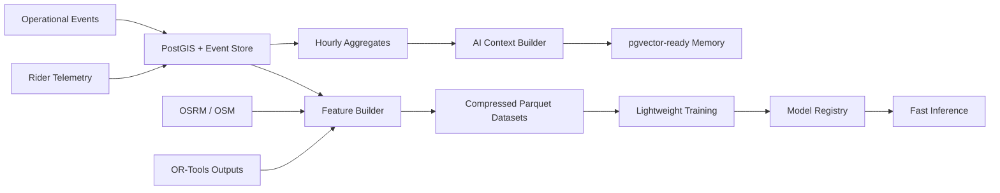

# ROVIK Data and ML Architecture

## Objective

ROVIK intelligence should come from efficient operational data, geospatial reasoning, optimization outputs, telemetry aggregation, and lightweight predictive models. The platform must remain credible for demos and future production while keeping all AI/data storage under 90-100 GB.

## Storage Budget

| Data Zone | Target | Retention |
| --- | ---: | --- |
| Chennai OSM and OSRM routing assets | 2-8 GB | Refresh manually or monthly |
| High-frequency rider telemetry | 5-15 GB | Raw 14 days, hourly aggregates 365 days |
| Operational events | 2-8 GB | Raw 90 days, summaries 2-3 years |
| Processed datasets and feature snapshots | 5-12 GB | Keep recent versions only |
| Model registry and checkpoints | <5 GB | Keep latest 20 artifacts |
| pgvector operational memory | 1-3 GB | Summarized context only |
| Logs, temporary files, Docker caches | 5-10 GB | Aggressive pruning |

## Data Categories

1. **Geospatial Data:** clipped OpenStreetMap extracts, OSRM graph assets, route geometry, road category metadata.
2. **Operational Events:** order, assignment, route, ETA, delivery, and alert lifecycle events.
3. **Rider Telemetry:** GPS pings, speed, heading, route progression, idle state, and delivery state.
4. **Delivery Workflow Data:** SLA, priority, timestamps, fulfillment state, failure reasons.
5. **Routing Data:** distance, duration, route complexity, traffic proxy, OSRM estimates.
6. **Optimization Outputs:** assigned rider, stop order, route cost, solver metadata, route deltas.
7. **Analytics Data:** hourly rider aggregates, delivery zone aggregates, SLA summaries.
8. **AI Context Data:** compact operational summaries and vectorized memory, not raw logs.
9. **ETA Training Data:** feature snapshots for route duration prediction.
10. **Delay Training Data:** feature snapshots for SLA breach probability.

## Pipeline Flow



## Local Data Collection

When Python is unavailable, ROVIK can still start bounded local collection with a dependency-free Node collector:

```powershell
.\scripts\collect-data.ps1
```

This writes compressed JSONL batches for operational events and rider telemetry into:

- `ml/datasets/raw`
- `ml/telemetry`
- `ml/analytics`

These batches are intentionally small, compressed, and retention-policy aligned.

Preprocess collected batches into compact operational features and analytics:

```powershell
.\scripts\preprocess-data.ps1
```

Run the full local data collection, preprocessing, training, evaluation, and model-export cycle:

```powershell
.\scripts\run-data-training-cycle.ps1
```

The selected model artifact is copied into the backend at `apps/api/routeiq/ml/model_artifacts/selected_operational_model.json` and served by `POST /api/v1/intelligence/predict`.

## Model Strategy

Use lightweight, inference-efficient models:

- ETA prediction: gradient boosting regressor
- Delay prediction: gradient boosting classifier
- Rider efficiency: random forest or gradient boosting regressor
- Delivery risk scoring: classifier over operational risk factors
- Operational anomaly detection: isolation forest

Do not train large LLMs locally. Future LLM workflows should consume structured summaries, embeddings, and tool outputs. Local Stage 1 stores embeddings in a portable numeric array so the default PostGIS Docker image works everywhere; production can migrate this column to pgvector.

## Dataset Versioning

Dataset versions should use deterministic names:

```text
rovik_eta_features_YYYYMMDD_city_chennai_vN.parquet
rovik_delay_features_YYYYMMDD_city_chennai_vN.parquet
```

Only recent feature snapshots should be retained locally. Older snapshots should be compacted into aggregate benchmarks or deleted.

## Model Versioning

Model names follow:

```text
eta_prediction_v1.joblib
delay_prediction_v1.joblib
rider_efficiency_v1.joblib
delivery_risk_v1.joblib
operational_anomaly_v1.joblib
```

Each model artifact stores metadata with target, features, and evaluation metrics.
