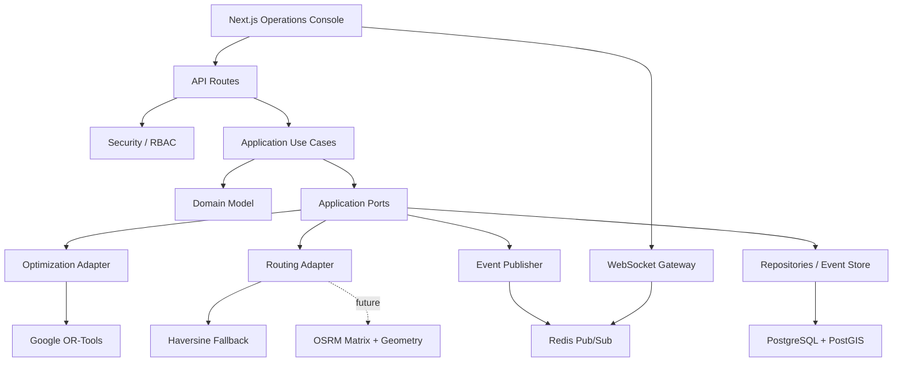

# Module Dependency Graph

## Dependency Rules

- Domain imports no framework-specific modules.
- Application use cases depend on ports, schemas, and domain types.
- Infrastructure implements ports.
- API routes depend on schemas, security, and use cases.
- Realtime infrastructure consumes events, not database internals.
- Frontend consumes typed API and realtime contracts, not backend implementation details.
