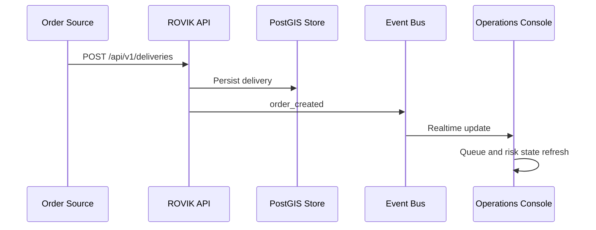
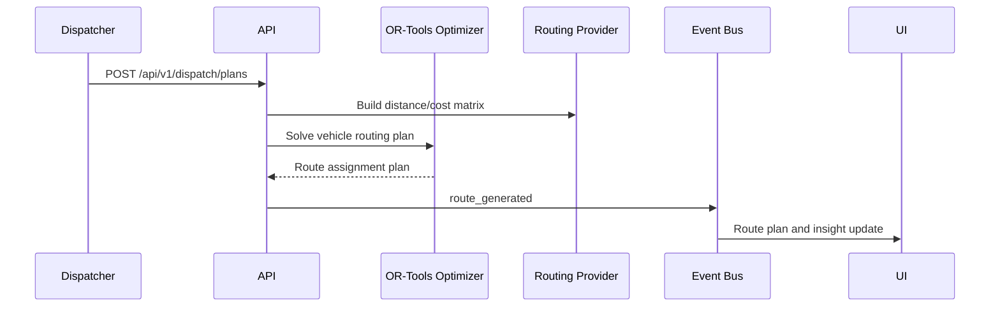
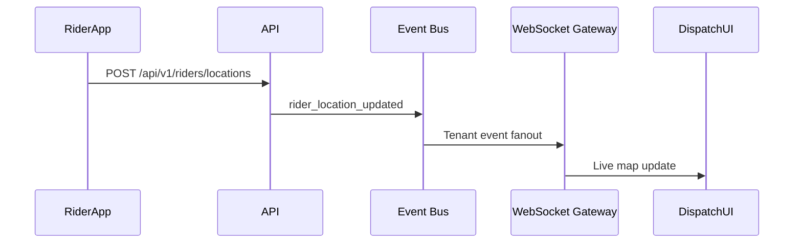
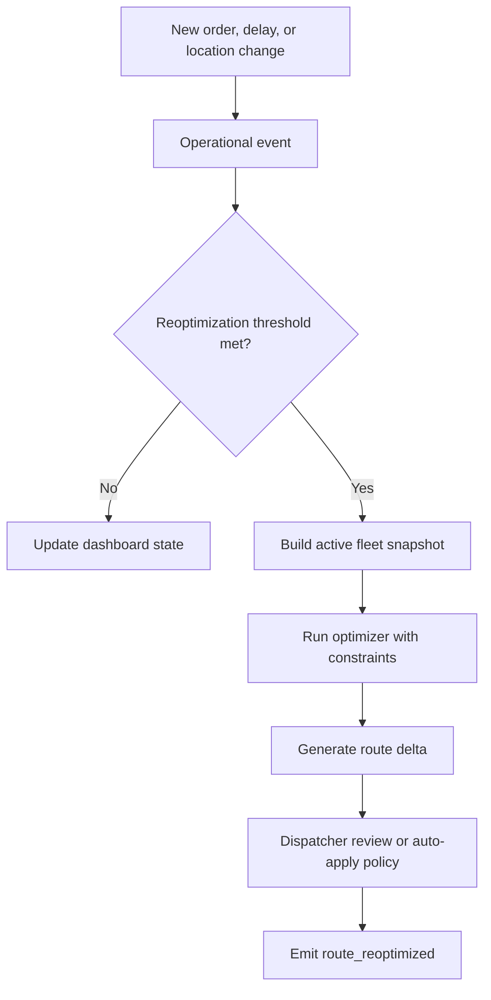
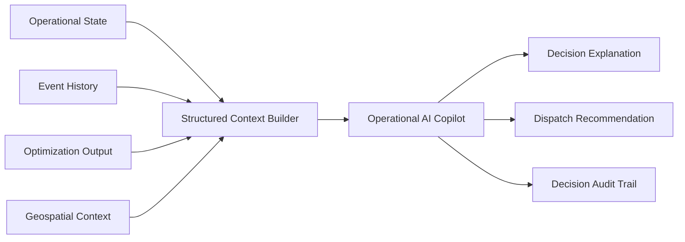

# Operational Workflows

## Delivery Intake

```mermaid
sequenceDiagram
  participant Client as Order Source
  participant API as ROVIK API
  participant DB as PostGIS Store
  participant Events as Event Bus
  participant UI as Operations Console

  Client->>API: POST /api/v1/deliveries
  API->>DB: Persist delivery
  API->>Events: order_created
  Events->>UI: Realtime update
  UI->>UI: Queue and risk state refresh
```

## Dispatch Plan Generation

```mermaid
sequenceDiagram
  participant Dispatcher
  participant API
  participant Optimizer as OR-Tools Optimizer
  participant Routing as Routing Provider
  participant Events as Event Bus
  participant UI

  Dispatcher->>API: POST /api/v1/dispatch/plans
  API->>Routing: Build distance/cost matrix
  API->>Optimizer: Solve vehicle routing plan
  Optimizer-->>API: Route assignment plan
  API->>Events: route_generated
  Events->>UI: Route plan and insight update
```

## Rider Location Streaming

```mermaid
sequenceDiagram
  participant RiderApp
  participant API
  participant Events as Event Bus
  participant WS as WebSocket Gateway
  participant DispatchUI

  RiderApp->>API: POST /api/v1/riders/locations
  API->>Events: rider_location_updated
  Events->>WS: Tenant event fanout
  WS->>DispatchUI: Live map update
```

## Reoptimization Loop

```mermaid
flowchart TD
  A["New order, delay, or location change"] --> B["Operational event"]
  B --> C{"Reoptimization threshold met?"}
  C -- "No" --> D["Update dashboard state"]
  C -- "Yes" --> E["Build active fleet snapshot"]
  E --> F["Run optimizer with constraints"]
  F --> G["Generate route delta"]
  G --> H["Dispatcher review or auto-apply policy"]
  H --> I["Emit route_reoptimized"]
```

## AI Operational Insight Flow

```mermaid
flowchart LR
  State["Operational State"] --> Context["Structured Context Builder"]
  Events["Event History"] --> Context
  Routes["Optimization Output"] --> Context
  GIS["Geospatial Context"] --> Context
  Context --> AI["Operational AI Copilot"]
  AI --> Explain["Decision Explanation"]
  AI --> Recommend["Dispatch Recommendation"]
  AI --> Audit["Decision Audit Trail"]
```
